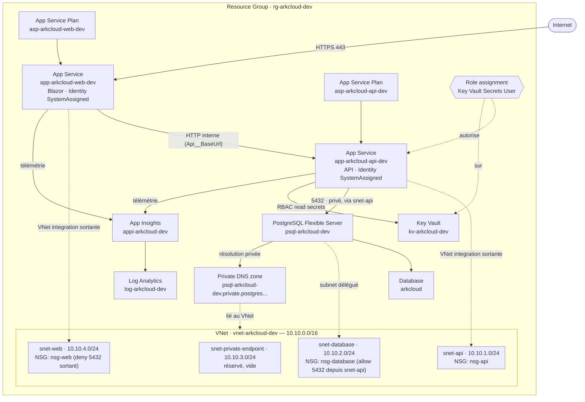
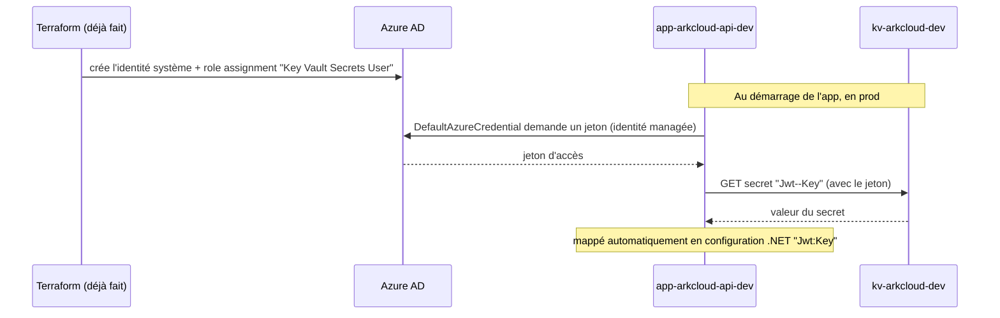

# Architecture réelle — environnement `dev`

Schéma et inventaire des 24 ressources Azure créées par `environments/dev` (premier `terraform apply` réussi). Complète `ArkCloudInfra/README.md` §4 (modules) et §4.5 (assemblage) avec la vue "tout assemblé, comme déployé".

## Schéma d'ensemble

**Lecture rapide** : un utilisateur entre par HTTPS sur Blazor (`APPWEB`), jamais directement sur l'API. Blazor appelle l'API en interne (`Api__BaseUrl`, posé automatiquement par Terraform — ni l'un ni l'autre ne code l'URL en dur). Seule l'API a une ligne vers PostgreSQL (`5432`, exclusivement via `snet-api` — bloqué depuis `snet-web` par `nsg-database` et interdit en sortie par `nsg-web`) et vers Key Vault (le rôle `Key Vault Secrets User`, posé par `module.keyvault_access_api`, n'existe que pour l'identité système de l'API). Les deux apps envoient leur télémétrie à Application Insights, qui centralise tout dans le même Log Analytics Workspace.

## Comment Key Vault s'intègre — le détail derrière la flèche

Quatre couches distinctes, dont une seule reste à faire :

1. **Infra (`ArkCloudInfra`, fait)** — `module.key_vault` crée le coffre (`kv-arkcloud-dev`, RBAC activé, purge protection). `module.keyvault_access_api` pose un `azurerm_role_assignment` : le rôle **Key Vault Secrets User** (lecture seule des valeurs de secrets, pas de gestion) accordé à un seul principal — l'identité système de `app-arkcloud-api-dev`. Rien d'équivalent pour Blazor : il n'en a pas besoin.
2. **Plateforme Azure (fait, automatique)** — `identity { type = "SystemAssigned" }` dans `module.app_service_api` fait qu'Azure AD attribue à l'App Service une identité propre, sans aucun credential à gérer ou faire tourner soi-même.
3. **Code applicatif (déjà écrit, `ArkCloud/backend/ArkCloud.API/Program.cs`)** — dès que l'app setting `KeyVault:Uri` est renseigné (ce que fait déjà `module.app_service_api` via `key_vault_uri = module.key_vault.vault_uri`), le code branche automatiquement le fournisseur de configuration Azure Key Vault, authentifié via `DefaultAzureCredential`. Ce mécanisme détecte tout seul l'identité managée quand il tourne dans Azure — aucune branche de code différente entre local et Azure.
4. **Valeurs des secrets (PAS ENCORE FAIT)** — le coffre est vide. Il manque `Jwt--Key` (le double tiret remplace le `:` qu'un nom de secret Key Vault n'accepte pas — se retrouve en configuration .NET comme `Jwt:Key`) et le mot de passe/la chaîne de connexion PostgreSQL. Prochaine étape §5 du README.

Point important : ce flux est identique en dev/staging/prod — seule la présence ou non des secrets dans le coffre change, jamais le code ni la façon dont il s'authentifie.

## Inventaire des 24 ressources

| # | Adresse Terraform | Type Azure | Nom réel |
|---|---|---|---|
| 1 | `module.resource_group.azurerm_resource_group.this` | Resource Group | `rg-arkcloud-dev` |
| 2 | `module.network.azurerm_virtual_network.this` | Virtual Network | `vnet-arkcloud-dev` |
| 3 | `module.network.azurerm_subnet.api` | Subnet | `snet-api` |
| 4 | `module.network.azurerm_subnet.web` | Subnet | `snet-web` |
| 5 | `module.network.azurerm_subnet.database` | Subnet | `snet-database` |
| 6 | `module.network.azurerm_subnet.private_endpoint` | Subnet | `snet-private-endpoint` |
| 7 | `module.network.azurerm_network_security_group.api` | NSG | `nsg-api` |
| 8 | `module.network.azurerm_network_security_group.web` | NSG | `nsg-web` |
| 9 | `module.network.azurerm_network_security_group.database` | NSG | `nsg-database` |
| 10 | `module.network.azurerm_subnet_network_security_group_association.api` | Association NSG↔subnet | `snet-api` ↔ `nsg-api` |
| 11 | `module.network.azurerm_subnet_network_security_group_association.web` | Association NSG↔subnet | `snet-web` ↔ `nsg-web` |
| 12 | `module.network.azurerm_subnet_network_security_group_association.database` | Association NSG↔subnet | `snet-database` ↔ `nsg-database` |
| 13 | `module.postgresql.azurerm_private_dns_zone.postgres` | Private DNS Zone | `psql-arkcloud-dev.private.postgres.database.azure.com` |
| 14 | `module.postgresql.azurerm_private_dns_zone_virtual_network_link.postgres` | Lien DNS↔VNet | `psql-arkcloud-dev-dns-link` |
| 15 | `module.postgresql.azurerm_postgresql_flexible_server.this` | PostgreSQL Flexible Server | `psql-arkcloud-dev` |
| 16 | `module.postgresql.azurerm_postgresql_flexible_server_database.arkcloud` | Base de données | `arkcloud` |
| 17 | `module.key_vault.azurerm_key_vault.this` | Key Vault | `kv-arkcloud-dev` |
| 18 | `module.monitoring.azurerm_log_analytics_workspace.this` | Log Analytics Workspace | `log-arkcloud-dev` |
| 19 | `module.monitoring.azurerm_application_insights.this` | Application Insights | `appi-arkcloud-dev` |
| 20 | `module.app_service_api.azurerm_service_plan.this` | App Service Plan | `asp-arkcloud-api-dev` |
| 21 | `module.app_service_api.azurerm_linux_web_app.this` | App Service (Linux, container) | `app-arkcloud-api-dev` |
| 22 | `module.app_service_web.azurerm_service_plan.this` | App Service Plan | `asp-arkcloud-web-dev` |
| 23 | `module.app_service_web.azurerm_linux_web_app.this` | App Service (Linux, container) | `app-arkcloud-web-dev` |
| 24 | `module.keyvault_access_api.azurerm_role_assignment.this` | Role Assignment | `Key Vault Secrets User` sur `kv-arkcloud-dev`, pour l'identité de `app-arkcloud-api-dev` |

## Ce qui n'est pas encore réel

- Aucun secret dans `kv-arkcloud-dev` (vault vide, créé mais pas alimenté).
- Aucune image dans le registre référencé par les deux App Services — les hostnames renvoient une page vide/erreur tant que `arkcloud-backend-ci.yml`/`arkcloud-frontend-ci.yml` ne poussent pas de vraies images.
- `snet-private-endpoint` : subnet créé, rien dedans (réservé Sprint 6).
